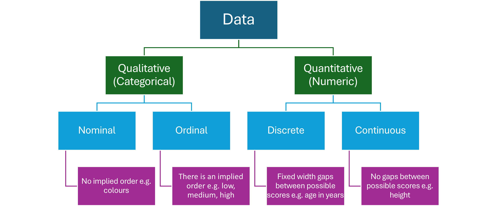

# Data Concepts {#data_concepts}

>**Learning Objectives**  
To uderstand the basic types of data  
To understand how data is structured for statistical analysis  
To determine the amount of data required for a scientific study  
To investigate methods of data collection  
To distinguish between primary and secondary sources  
To review some secondary sources of scientific data  
To learn the steps in preparing data for statistical analysis

## Types of Data



> *Count data* is quantitative discrete data in which the number of occurrences of something are recorded e.g. the number of birds in migratory flocks.

## The Structure of Data

Data should be structured using tables in which 

* each column represents a variable
* the values in each column are the same type and the same unit
* the first row contains the names of the variables without any spaces

The data in each row represents a single *observation* of the variables. Observations are often called *records* or *cases*, depending on the context of the study. Similarly, columns are often called *attributes* or *features*.

-----

### Extension

-----


### Activity

1. List the variables and the type of data they represent for the following data set.
2. Write down one observation from the table.

```{r}
set.seed(98)
print.data.frame(iris[sample(nrow(iris), 6),], row.names = FALSE) # to suppress printing row numbers
```


## Collecting Data

Data sources can be classified as either *primary* or *secondary*.

>**Primary Source Data** is collected by the researcher through first-hand surveys.
> **Secondary Source Data** is collected from existing data repositories.

### How Much Data Is Enough?

* depends on the aim of the research
* experimental versus observational studies
* rare cases and noise
* data overload and the increasing importance of cloud processing for large data sets

### Activity - Online Data Repositories

Explore the following data repositories and complete the table.

Repository|Main Uses|Formats|Cloud Processing (y/n)
----------|---------|-------|----------------------
|[ABS](https://www.abs.gov.au/)| |
|[data.gov.au](https://data.gov.au/)| | 
|[SEED NSW](https://www.seed.nsw.gov.au/)| | 
|[Digital Earth Australia](https://www.ga.gov.au/scientific-topics/dea)| | 
|[Atlas of Living Australia](https://www.ala.org.au/)| |


## Data Cleaning

Most data needs preparation or "cleaning" before statistical analysis can begin.

There is an expression that says "10 percent inspiration, 90 percent perspiration". In the case of statistics, preparing data for analysis is often the "90 percent perspiration"! Most real-world data sets will need a lot of cleaning before they are suitable for use in a research project. 

Some of the issues that need to be checked and remedied are

* missing values, often labelled as **NA**, but might just be blank - impute, drop, or ignore?
* incorrect number formats e.g. differing numbers of decimal places, missing decimal points: 1.02, 1.15, 103, 1.96
* units included in quantitative columns e.g. 9.1, 3.2, 5.8mm, 6.7 
* Not the correct number of rows e.g. your data set should have 1000 rows, but it only has 100 when you open it
* duplicate categories in qualitative variables e.g. dog, cat, cat, dogs, cats
* dates and times are not recognised correctly by the software
* outliers
* zero inflated count data e.g. the number of daily observations of a rare species will often be 0
* duplicate records
* removing irrelevant variables; finding the relevant ones amongst hundreds
* variables that have only one value or are empty
* empty rows, cells, merged cells in spreadsheets :(

... and the list goes on. 

>**Tip**  
For a small project where you are working alone or in a small team, avoid most of these problems by developing a thorough plan and keeping accurate records. Do not change your methods once you have started recording data.

### Activity

Open the [introduced_plants.csv](resources/datasets/introduced_plants.csv) data set in a spreadsheet. The objective of this study is to identify the top 10 most frequently recorded introduced plant species in the study area (Blackheath, NSW), and to plot a map of these observations. Find any issues with the data and decide what should be done to prepare the data for the intended analysis.
