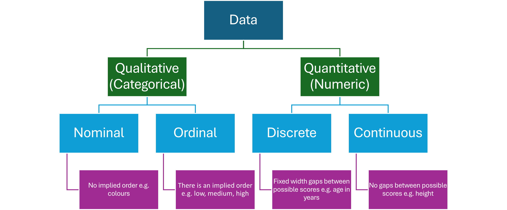
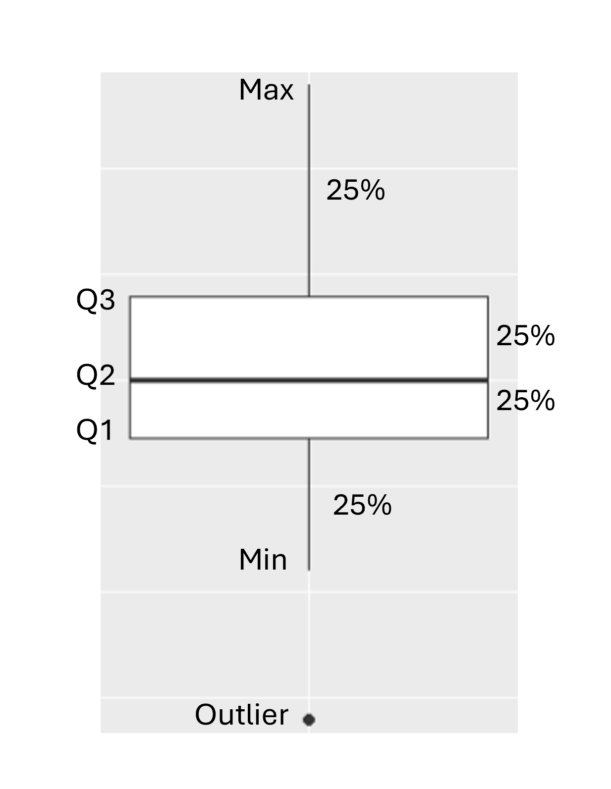

# Exploring Data {#exploring-data}

## Types of Data



## The Structure of Data

Data should be structured using tables in which 

* each column represents a variable
* the values in each column are the same type and the same unit
* the first row contains the names of the variables without any spaces

In the following table, the first four columns are quantitative continuous variables. The last column is a qualitative variable used to **group** the measurements for each of the species.

```{r}
print.data.frame(iris[1:6,], row.names = FALSE) # to suppress printing row numbers
```


## Common Statistical Plots

In school we usually use the word "graph", but statisticians usually use the word "plot".

### Boxplot

Boxplots are used to 

* show the distribution of data for each quartile of a quantitative variable.
* identify outliers
* compare groups

{width=50%}

The following boxplots show the distribution of Sepal Length grouped by species.

```{r}
iris %>% 
  ggplot(aes(group = Species)) +
  geom_boxplot(aes(x = Species, y = Sepal.Length)) +
  labs(title = "Boxplot of Sepal Length For Each Species", y = "Sepal Length (mm)")
```

#### Questions

1. What do the thicker black lines inside the boxes represent?
2. What is similar and what is different about the three boxplots? Think in terms of spread and skewness.

### Histogram

Histograms are used to help identify the type of distribution from which the data was drawn. 

```{r}
iris %>% 
  ggplot(aes(group = Species)) +
  geom_histogram(aes(x = Sepal.Length), bins = 11) +
  facet_wrap(.~Species) +
  labs(title = "Histogram of Sepal Length For Each Species", x = "Sepal Length", y = "Frequency")
```

The histograms confirm that the distribution of Sepal.Length is approximately symmetrical for each species. This suggests that a normal distribution might be an appropriate model in each case. Also notice that there is an outlier in the virginica species, as was identified by the boxplot.

### Scatter Plot

Scatter plots identify relationships between quantitative variables. 

```{r}
iris %>% 
  ggplot() +
  geom_point(aes(x = Sepal.Length, y = Sepal.Width)) +
  facet_wrap(.~Species) +
  labs(title = "Scatterplot of Sepal Length Vs Sepal Width")
```


### Line Plot

Line plots are often used for time series data e.g. daily temperatures in March.

```{r}
plot(co2, main = "Atmospheric CO2 Concentrations at Mauna Loa Hawaii")
```

#### Questions

1. Describe the trend in the CO2 concentration.
2. Why does the plot zig-zag up and down?


## Exploratory Data Analysis (EDA)

Once the study has been designed and executed, it's time to begin analysing the results. The first step in analysis is getting to know the dataset. The steps of exploratory data analysis (EDA) include

* summarising quantitative variables - min, max, quantiles, mean, standard deviation
* using boxplots and histograms to investigate spread and skewness
* using scatter plots to investigate associations between quantitative variables
* using grouping variables to investigate the similarities and differences between groups

## Activity

Use the Iris dataset and a spreadsheet to

1. Create a summary of each quantitative variable including min, max, quantiles, mean, standard deviation
2. Create boxplots for the four quantitative variables in the dataset. 
3. Create histograms for the four quantitative variables in the dataset.

### Challenge

1. Using the Iris dataset, create boxplots of Sepal Length grouped by Species using Excel. Hint: Watch https://youtu.be/Sj3czWwAsjM?si=GyDPaJM4yNjmoOZ2 

